# Automated-Docker-Image-Deployment-to-Amazon-ECR-with-Jenkins-and-Lambda-Integration

## Project Overview
This project demonstrates the implementation of a real-world CI/CD pipeline that automates the process of building Docker images, pushing them to Amazon Elastic Container Registry (ECR), and triggering AWS Lambda for post-deployment automation.
The pipeline is fully automated using Jenkins, while Terraform is used to provision AWS infrastructure such as ECR, IAM roles, and Lambda functions. Secure authentication is achieved using IAM roles, eliminating the need for hard-coded AWS credentials.

## Architecture
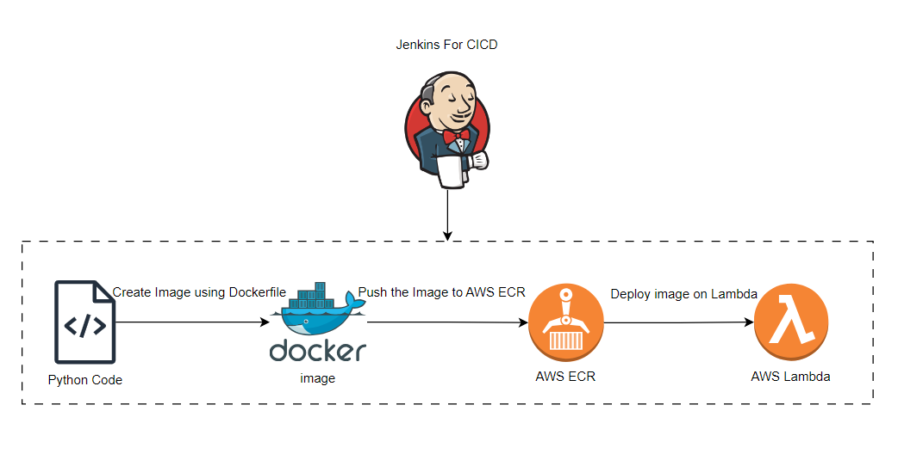
## Tools & Technologies Used
- GitHub - Source code management
- Jenkins - CI/CD automation
- Docker - Containerization
- Amazon ECR - Container image registry
- AWS Lambda - Post-deployment automation
- Terraform - Infrastructure as Code
- GitHub - Source code management
- AWS IAM - Secure access control
- AWS CLI - AWS service interaction

## Architecture Overview
- Pushes code to GitHub
- Jenkins pulls the latest code
- Jenkins builds Docker image
- Jenkins authenticates to Amazon ECR
- Jenkins pushes Docker image to ECR
- Jenkins invokes AWS Lambda
- Lambda performs post-deployment tasks (logging, automation)

## Structure
```
Automated-Docker-Image-Deployment-to-Amazon-ECR-with-Jenkins-and-Lambda-Integration/
│
├── app/
│   ├── app.py
│   ├── requirement.txt
│   └── Dockerfile
│
├── lambda/
│   ├── lambda_function.py
│   └── lambda.zip
│
├── terraform/
│   ├── provider.tf
│   ├── ecr.tf
│   ├── iam.tf
│   ├── lambda.tf
│   ├── outputs.tf
│
├── jenkins/
│   └── Jenkinsfile
│
└── README.md

```

# Steps To Do:
## PHASE 1: Application Setup
### Step 1: Create Sample Application ( Python flask )
- Create a Main folder for project files
- In that create folder `app` for application file
- Create `app/app.py`
- Creates a simple web application that will be containerized
- For code- [APP code](app/app.py)
- Without an app, Docker and Jenkins have nothing to build or deploy
- Create file `requirement.txt` inside app folder
- `app/requirement.txt` [requirement.txt](app/requirement.txt)

### Step 2: Create Dockerfile
- Create `Dockerfile` inside `app/`
- It defines how the application should be packaged into a Docker image
- In this dockerfile expose correct port for python
- This docker file uses light weight image
- Click to see [Dockerfile](app/Dockerfile)

## PHASE 2: Infrastructure Setup using Terraform
#### Terraform automatically creates: ___Amazon ECR repository, AWS Lambda function, IAM roles and permissions___ to avoids manual AWS setup.
#### Terraform ensures reliability and easy re-creation of infrastructure
### Step 3: Configure AWS Provider
- Create a `terraform` folder inside the project folder
- Now create configuration files in terraform folder
- Now Configure AWS provider 
- `terraform/provider.tf ` create 
- Click -  [provider.tf](terraform/provider.tf)

### Step 4: Create Amazon ECR Repository
- Create a configuration file for  Amazon ECR repo
- To stores Docker images securely in AWS & acts as a private Docker registry
- ECR is safer and more scalable than local or public registries
- ` terraform/ecr.tf`
- click - [ecr.tf](terraform/ecr.tf)

### Step 5: Create IAM Role and Permissions for Lambda
- Create a IAM role for lambda
- `terraform/iam.tf`
- click - [iam.tf](terraform/iam.tf) 
- Grants Jenkins permission to: _Push images to ECR, Invoke Lambda_
- Grants Lambda permission to: _Write logs to CloudWatch_
- Improves security and follows least-privilege principle

### Step 6: Create AWS Lambda Function
- Create lambda function 
- `terraform/lambda.tf`
- click - [lambda.tf](terraform/lambda.tf)
- Executes automatically after Docker image is pushed
- Lambda allows serverless automation without managing servers

- In this configuration file we add `lambda.zip`
- `lambda.zip` is a deployment package for AWS Lambda
- It contains the Lambda code and dependencies if any
- AWS Lambda requires code to be uploaded in ZIP format
- `lambda.zip` Contains `index.py` 
```
lambda.zip
 └── index.py
```
- `index.py`
```
def handler(event, context):
    print("New Docker Image Pushed:", event)
    return "Lambda executed successfully"
```
- After that zip it into `lambda.zip`
- for that on run cmd on bash
```
zip lambda.zip index.py
```
### Step 7: Terraform Output
- Create `output.tf` for ECR repo url
- `terraform/output.tf`
- click - [output.tf](terraform/output.tf)

#### Push all file to GitHub
### Create Lambda folder
- `lambda/lambda_function.py`
- This is the actual Lambda function code that runs in AWS
- Receives the Docker image tag from Jenkins
- Logs deployment information
- Can be extended for notifications or automation
- AWS Lambda needs a handler function
- Jenkins sends payload to this function
- Keeps post-deployment logic separate from CI/CD
- [lambda_function.py](lambda/lambda_functon.py)
### Step 8: Apply Terraform
- Create one seperate server for terraform or use Git bash to create infrastructure
- In that server clone the Github repo
- `cd` to that repo directory
- Now
```bash
cd terraform
terraform init
terraform plan
terraform apply
```
- After successfully Apply complete get the output
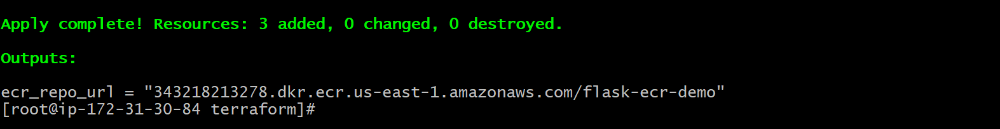

## PHASE 3: Jenkins Setup
### Step 9: Jenkins Prerequisites
- Launch an EC2 instance for ___Jenkins___ 
- Use `Ubuntu` AMI for Jenkins server
- In security group Add Ports :`22 (SSH), 8080 (Jenkins), 80 (HTTP)`
- __Install on Jenkins Server:__
    - Java
    - Jenkins
    - Docker
    - AWS CLI
- Docker: Builds and tags container images
- AWS CLI: Allows Jenkins to communicate with AWS services
- __Install Java & Jenkins__
```bash
# Update the server
sudo apt update && sudo apt upgrade -y

#install java
sudo apt install openjdk-17-jdk -y

#Install jenkins

sudo wget -O /etc/apt/keyrings/jenkins-keyring.asc \
https://pkg.jenkins.io/debian-stable/jenkins.io-2023.key

echo "deb [signed-by=/etc/apt/keyrings/jenkins-keyring.asc]" \
https://pkg.jenkins.io/debian-stable binary/ | sudo tee \
  /etc/apt/sources.list.d/jenkins.list > /dev/null

sudo apt-get update

sudo apt-get install jenkins
```

- __Install Docker__
```bash

sudo apt install docker.io -y
sudo systemctl start docker
sudo systemctl enable docker

#ALLOW JENKINS USER TO USE DOCKER
sudo usermod -aG docker jenkins

sudo systemctl restart docker

```
- __Install AWS CLI__
```bash

curl "https://awscli.amazonaws.com/awscli-exe-linux-x86_64.zip" -o "awscliv2.zip"
unzip awscliv2.zip
sudo ./aws/install

```

### Step 10: IAM Role for Jenkins EC2
- Create Role for Jenkins server
- Create one IAM role `jenkins` 
- Attach IAM role with:
    - ECR push permissions
    - Lambda invoke permission
```
- AmazonEC2ContainerRegistryFullAccess
- AWSLambda_FullAccess
```
- And then attach to Jenkins Server
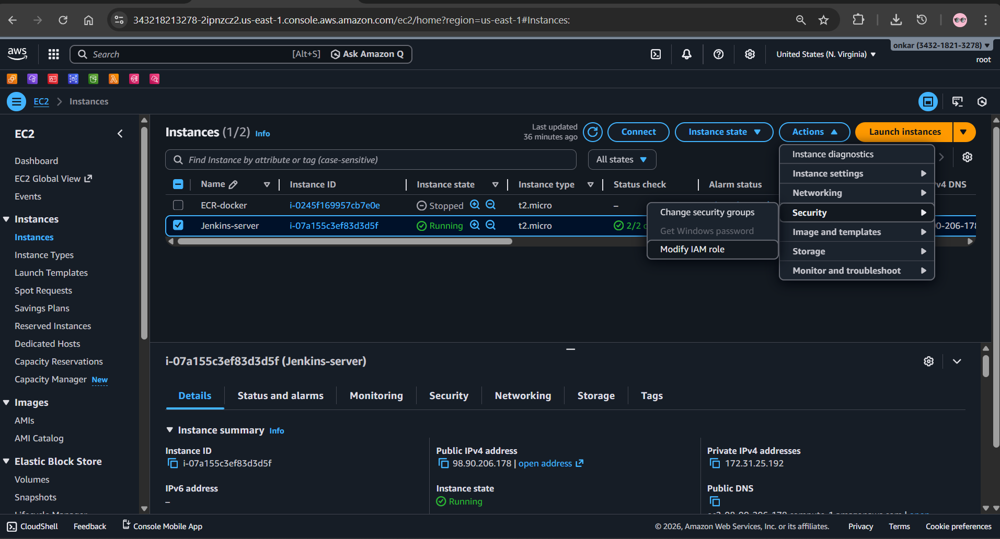


### Step 11: Jenkins Pipeline (Jenkinsfile)
- Create Jenkinsfile
- `jenkins/jenkinsfile`
- Write `jenkinsfile` 
- Pipeline Stages:
    - Checkout – Pulls latest code from GitHub
    - Build Image – Builds Docker image
    - Login to ECR – Authenticates using IAM role
    - Push Image – Pushes Docker image to ECR
    - Post Action – Invokes AWS Lambda

- Click- [jenkinsfile](jenkins/jenkinsfile)

## PHASE 4: Validation & Verification
### Step 12: Login to Jenkins
- After all setup complete
- check jenkins are visible or not
- Hit to Browser
```
<jenkins-server-Public-IP>:8080
```
- Setup Jenkins and Create user
- Sign in to jenkins 
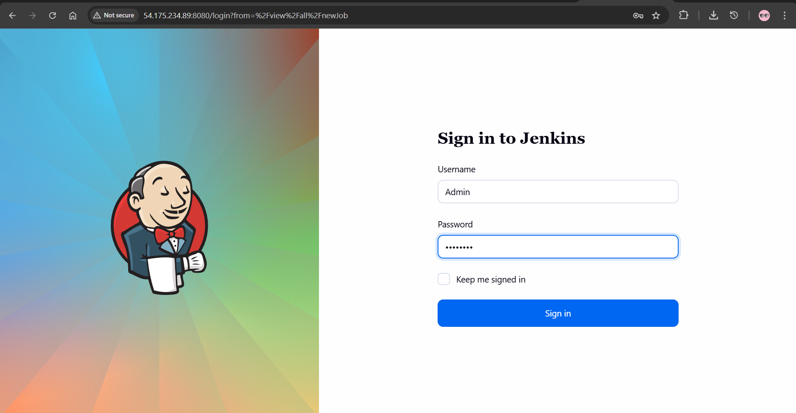
#### Install Required Jenkins Plugins
- Go to Jenkins, `Settings → Manage Jenkins → plugins`
- Click on `Available plugins` and Search for Plugins:
    - Git Plugin
    - Pipeline Plugin
    - SSH Agent Plugin
    - GitHub Plugin

- Install all this Plugins
- In jenkins console click on `new item`
- In new item, create a Job
- Give Name for job
- Select Item type, Click on `Pipeline`
- Click on Ok to create
- Now setup Pipeline
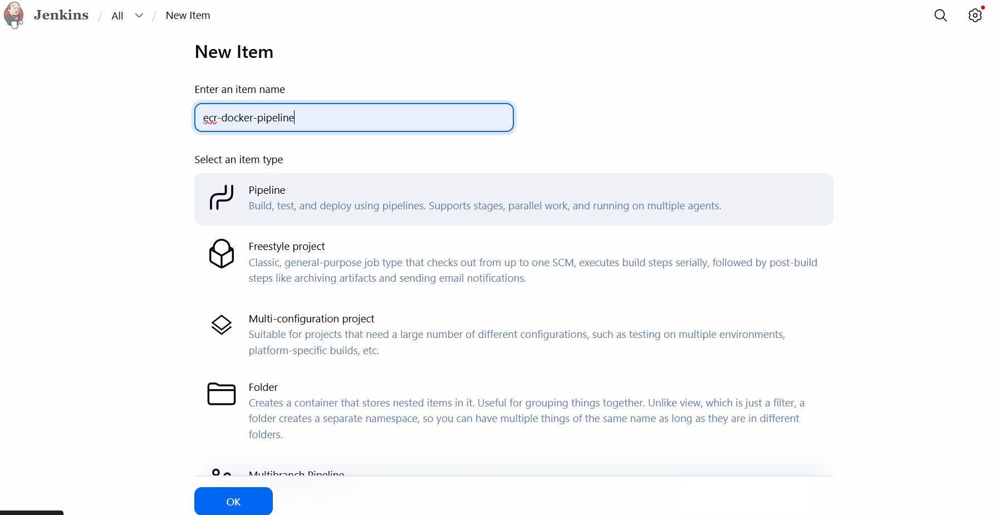
#### Configure Job
- In `Pipeline` section
- In definition select - `Pipeline script from SCM`
- In SCM, select - `GIT`
- Copy the URL of `Project repo url` and paste on `Repository URL`
- In Branch Specifier - check branch of Repository and then add */master
- In Script Path - add the jenkinsfile name from Repository `as it is given in Repository`, a path of jenkinsfile where pipeline script is written
- And then save

#### Run Build
- Click on `Build Now`
- Jenkins clones the latest code from your GitHub repository
### Step 13: Jenkins Console Output
- Succesfully Deployed CICD Pipeline
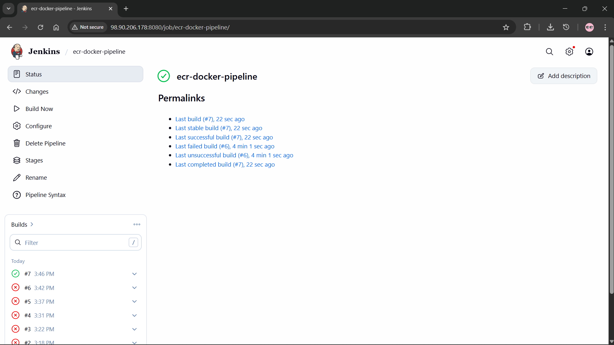
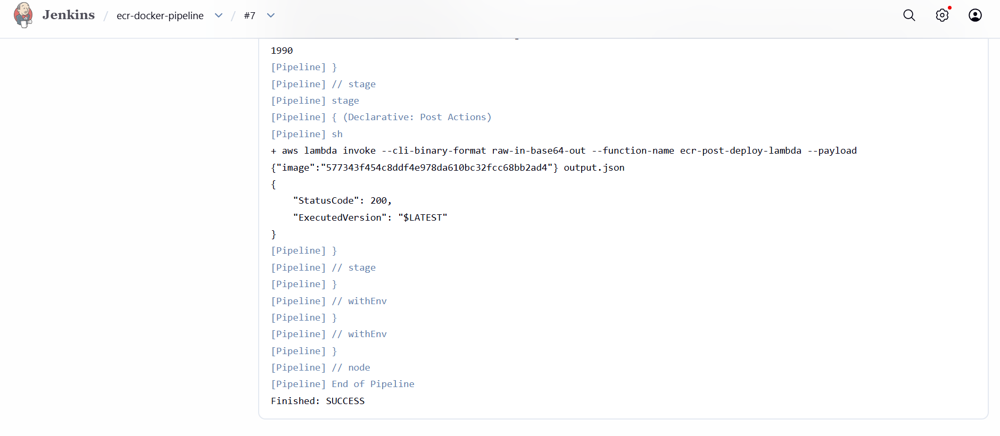

### Step 14: Amazon ECR
- Docker image is visible in the ECR repository
- `flask-ecr-demo`
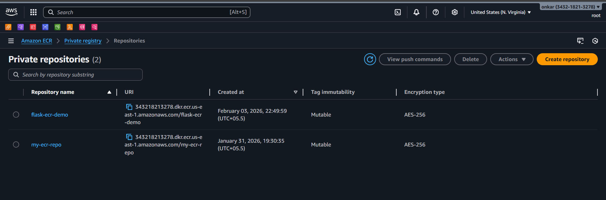
- Image tag matches Jenkins commit hash
- Image visible with commit hash tag
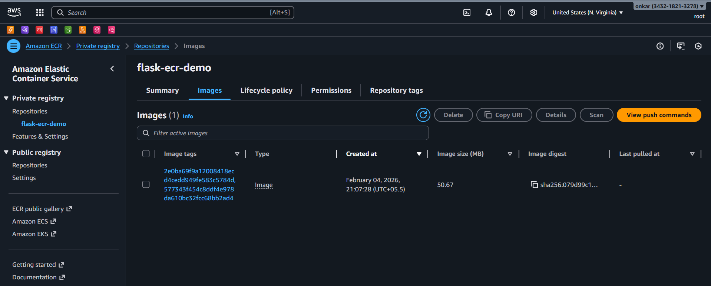
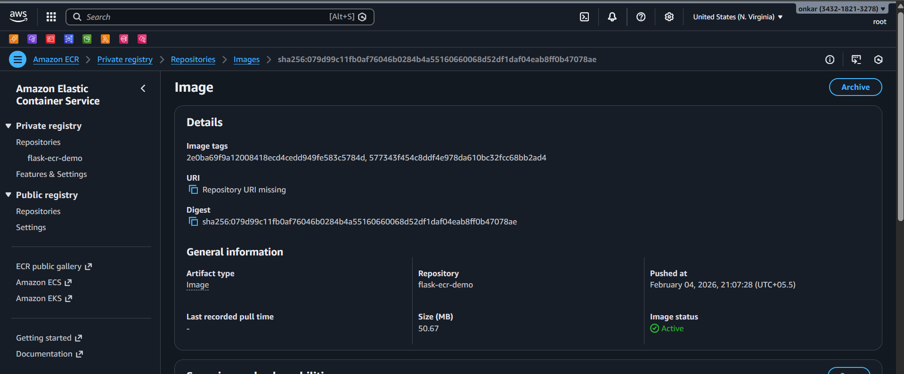
### Step 15: AWS Lambda
- Lambda function executed successfully
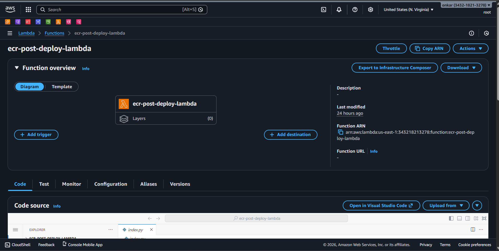

- CloudWatch logs show Lambda execution
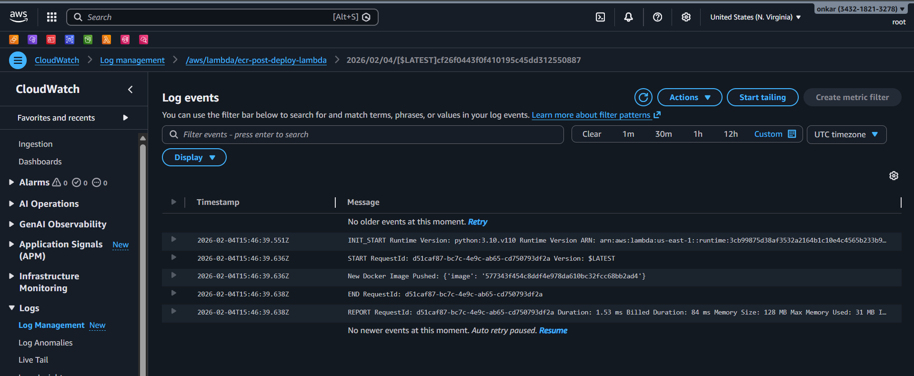

#### Flow of Deployment
- End-to-end automation
`GitHub → Jenkins → Docker → Amazon ECR → AWS Lambda`
#### Whole file structure of project in server
 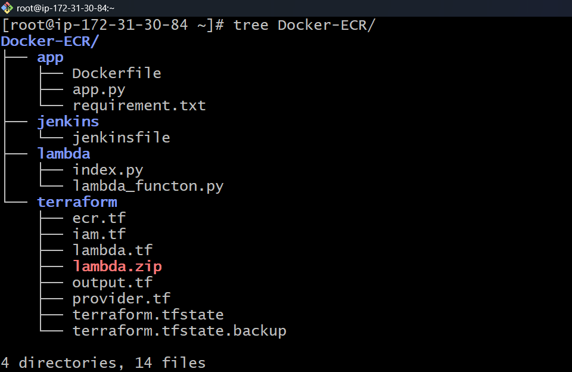
#### GitHub structure
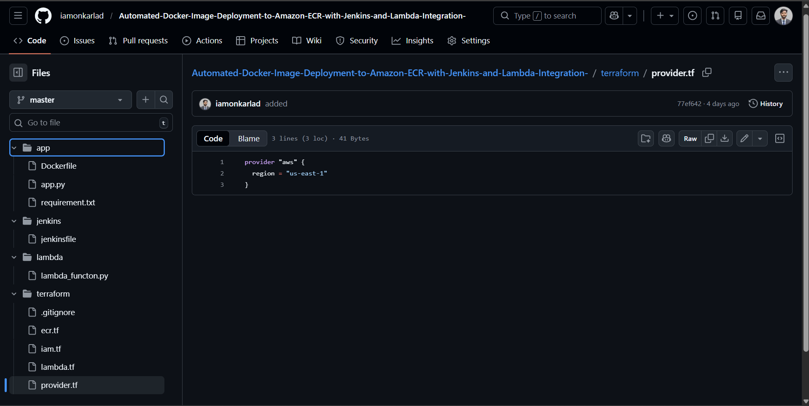

### 🧹 Final Cleanup Step – Terraform Destroy
- Run cmd `terraform destroy` on Terraform server
- After successful validation of the CI/CD pipeline, all AWS resources were safely removed using terraform destroy to avoid unnecessary cloud costs and ensure proper infrastructure lifecycle management.

## Project Summary
This project implements a complete end-to-end CI/CD automation workflow using Jenkins, Docker, AWS, and Terraform. The pipeline automatically builds a Docker image from application source code, securely pushes the image to Amazon Elastic Container Registry (ECR), and triggers an AWS Lambda function for post-deployment automation.

All AWS infrastructure—including ECR, IAM roles, and Lambda—is provisioned using Terraform, ensuring consistency, repeatability, and easy cleanup. Secure authentication is handled through IAM roles, eliminating the need for hard-coded AWS credentials and following cloud security best practices.

The project demonstrates a production-style DevOps workflow, covering source control, containerization, CI/CD automation, cloud integration, and infrastructure as code, making it highly suitable for real-world deployments, interviews, and portfolio showcasing.